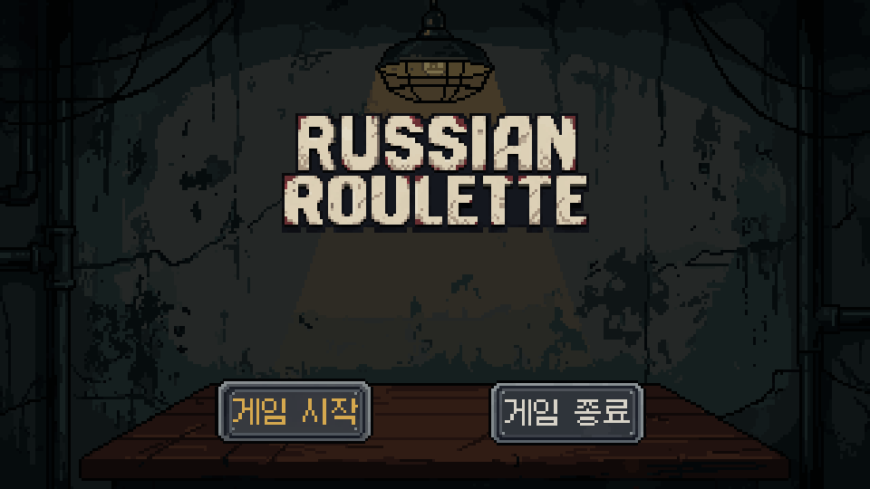
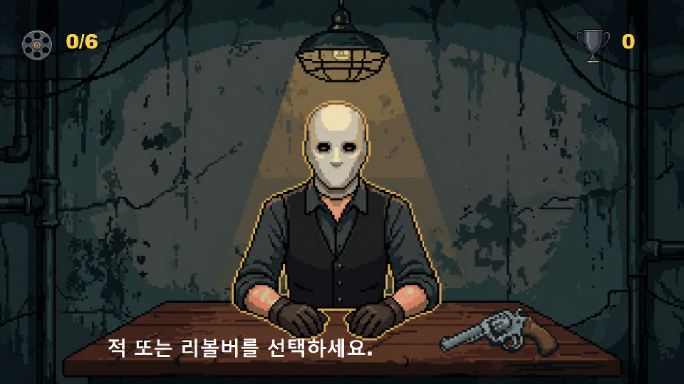
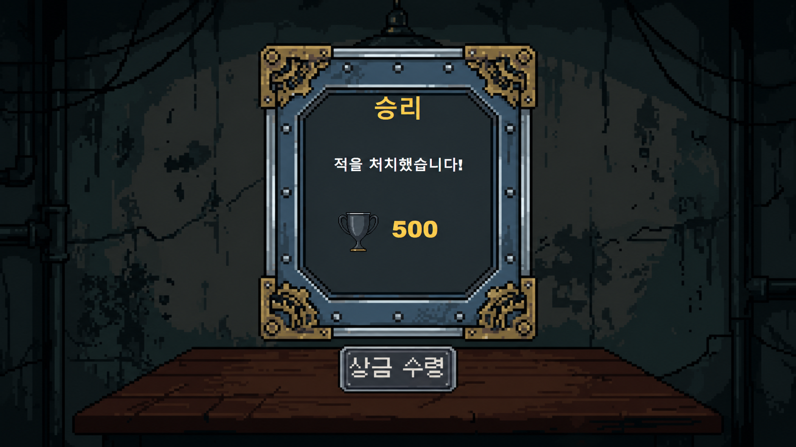
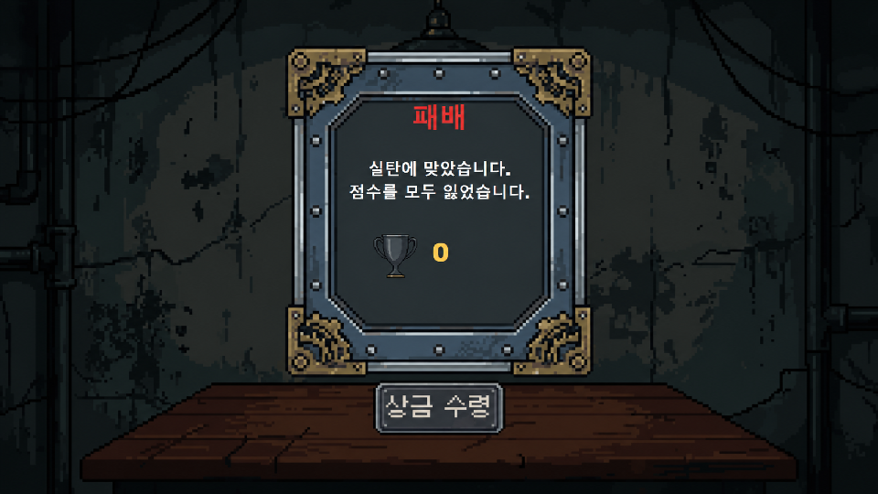

# 러시안 룰렛 게임 기획서

## 1. 게임 개요

| 항목 | 내용 |
|---|---|
| 게임명 | 러시안 룰렛 |
| 장르 | 확률 기반 심리 게임 |
| 예상 플레이 시간 | 1~2분 |
| 게임 방식 | 플레이어와 적의 단판 대결 |
| 조작 방식 | 마우스 이동 및 왼쪽 클릭 |

---

## 2. 기획 의도

플레이어와 적이 하나의 리볼버를 사용하여 대결하는 간단한 확률 게임이다.

플레이어는 자신의 차례마다 자신과 적 중 누구에게 사격할지 선택할 수 있다. 자신에게 사격하여 공포탄이 나오면 보너스 점수를 획득하고 차례를 유지하지만, 실탄이 나오면 즉시 패배한다.

적에게 사격하면 플레이어가 즉시 사망할 위험은 없지만, 공포탄이 나오면 적에게 차례가 넘어간다. 적은 자신의 차례가 되면 항상 플레이어에게 사격한다.

복잡한 이동이나 전투 조작 없이 마우스 선택만으로 진행할 수 있도록 구성한다. 사용한 약실이 늘어날수록 실탄이 발사될 가능성이 높아지는 규칙을 통해 짧은 플레이 안에서도 긴장감을 제공한다.

---

## 3. 핵심 재미

> 위험을 감수하고 자신에게 사격해 추가 점수를 얻을 것인가, 적에게 사격해 승리를 노릴 것인가?

### 3.1 자신에게 사격

- 공포탄이 나오면 100점을 획득한다.
- 공포탄이 나오면 플레이어의 차례가 유지된다.
- 실탄이 나오면 플레이어가 즉시 패배한다.
- 패배하면 지금까지 획득한 점수를 모두 잃는다.

### 3.2 적에게 사격

- 실탄이 나오면 적을 처치하고 승리한다.
- 적을 처치하면 500점을 획득한다.
- 공포탄이 나오면 적에게 차례가 넘어간다.
- 적은 자신의 차례에 플레이어에게 자동으로 사격한다.

### 3.3 확률에 따른 긴장감

- 리볼버는 6개의 약실과 1개의 실탄으로 구성된다.
- 실탄이 들어 있는 약실은 게임마다 무작위로 결정된다.
- 방아쇠를 당길 때마다 다음 약실로 이동한다.
- 실탄의 정확한 위치는 플레이어에게 공개하지 않는다.
- 사용한 약실이 늘어날수록 다음 사격의 위험성이 높아진다.

---

## 4. 게임 목표

플레이어의 기본 목표는 자신이 실탄에 맞기 전에 적을 처치하는 것이다.

더 높은 점수를 얻으려면 자신에게 총을 겨누는 위험한 선택을 해야 한다. 플레이어는 현재 사용한 약실 수를 확인하면서 추가 점수를 노릴지, 적에게 발사해 게임을 끝낼지 결정한다.

### 4.1 승리 조건

- 플레이어가 적에게 총을 발사한다.
- 현재 약실에서 실탄이 발사된다.
- 적을 처치하고 승리 결과 화면으로 이동한다.

### 4.2 패배 조건

다음 상황에서 플레이어가 패배한다.

- 플레이어가 자신에게 총을 발사했을 때 실탄이 나온 경우
- 적이 플레이어에게 총을 발사했을 때 실탄이 나온 경우

플레이어가 패배하면 지금까지 획득한 점수를 모두 잃고 최종 점수는 0점이 된다.

---

## 5. 기본 설정값

| 항목 | 설정값 | 설명 |
|---|---:|---|
| 전체 약실 수 | 6개 | 리볼버의 전체 약실 수 |
| 실탄 수 | 1발 | 게임마다 무작위 약실에 배치 |
| 적 수 | 1명 | 한 게임에서 상대하는 적 |
| 시작 순서 | 플레이어 | 게임 시작 시 플레이어가 먼저 행동 |
| 자신 사격 보너스 | 100점 | 자신에게 사격해 공포탄이 나온 경우 |
| 적 처치 점수 | 500점 | 적에게 실탄을 발사한 경우 |
| 적 사격 대기 시간 | 1.5초 | 적 차례가 된 후 발사할 때까지의 시간 |
| 플레이어 사망 시 점수 | 0점 | 획득한 점수를 모두 잃음 |

### 5.1 약실 사용 횟수

플레이 화면 왼쪽 위에는 현재까지 사용한 약실 수를 표시한다.

```text
사용한 약실 수 / 전체 약실 수
```

게임 시작 시에는 아직 사용한 약실이 없으므로 `0/6`으로 표시한다.

한 번 방아쇠를 당기면 `1/6`, 두 번 당기면 `2/6`으로 증가한다.

| 화면 표시 | 상태 |
|---|---|
| 0/6 | 아직 방아쇠를 당기지 않음 |
| 1/6 | 약실 1개 사용 |
| 2/6 | 약실 2개 사용 |
| 3/6 | 약실 3개 사용 |
| 4/6 | 약실 4개 사용 |
| 5/6 | 약실 5개 사용 |

### 5.2 남은 약실에 따른 실탄 확률

앞선 약실에서 공포탄이 나온 경우, 남은 약실 중 하나에는 반드시 실탄이 존재한다.

| 남은 약실 | 다음 사격에서 실탄이 나올 확률 |
|---:|---:|
| 6개 | 1/6 |
| 5개 | 1/5 |
| 4개 | 1/4 |
| 3개 | 1/3 |
| 2개 | 1/2 |
| 1개 | 1/1 |

---

## 6. 게임 규칙

### 6.1 게임 시작

1. 시작 화면에서 `게임 시작`을 선택한다.
2. 현재 점수를 0점으로 초기화한다.
3. 1번부터 6번 중 실탄이 들어갈 약실을 무작위로 결정한다.
4. 현재 약실을 첫 번째 약실로 설정한다.
5. 플레이어의 차례로 게임을 시작한다.
6. 화면 아래에 다음 안내 문구를 표시한다.

```text
적 또는 리볼버를 선택하세요.
```

### 6.2 플레이어 차례

플레이어는 자신의 차례에 다음 두 대상 중 하나를 선택한다.

1. 화면 중앙의 적을 클릭하여 적에게 사격한다.
2. 테이블 위의 리볼버를 클릭하여 자신에게 사격한다.

플레이어의 차례에 마우스를 적이나 리볼버 위에 올리면 외곽선이 있는 선택 이미지로 변경된다.

적의 차례에는 적과 리볼버를 선택할 수 없다.

### 6.3 자신에게 사격

플레이어가 리볼버를 선택하면 자신에게 사격한다.

#### 공포탄인 경우

- 플레이어가 생존한다.
- 현재 점수에 100점을 추가한다.
- 플레이어의 차례를 유지한다.
- 다음 문구를 표시한다.

```text
공포탄입니다! 위험 보너스 100점을 획득했습니다.
```

결과 문구를 일정 시간 표시한 뒤 다음 문구로 돌아간다.

```text
적 또는 리볼버를 선택하세요.
```

#### 실탄인 경우

- 플레이어가 즉시 사망한다.
- 현재 점수를 0점으로 초기화한다.
- 패배 결과 화면으로 이동한다.

### 6.4 적에게 사격

플레이어가 적을 선택하면 적에게 사격한다.

#### 공포탄인 경우

- 적이 생존한다.
- 추가 점수는 지급하지 않는다.
- 플레이어의 차례가 끝난다.
- 적에게 차례가 넘어간다.
- 다음 문구를 표시한다.

```text
공포탄입니다. 적이 총을 겨누고 있습니다...
```

#### 실탄인 경우

- 적이 사망한다.
- 현재 점수에 500점을 추가한다.
- 승리 결과 화면으로 이동한다.

### 6.5 적의 차례

1. 적은 자신의 차례가 되면 1.5초 동안 대기한다.
2. 대기 시간이 지나면 플레이어에게 자동으로 사격한다.
3. 적의 차례에는 플레이어가 대상을 선택할 수 없다.

#### 공포탄인 경우

- 플레이어가 생존한다.
- 다음 문구를 표시한다.

```text
적이 발사했지만 공포탄이었습니다.
```

- 결과 문구를 일정 시간 표시한다.
- 이후 플레이어의 차례로 돌아간다.
- 선택 안내 문구를 다시 표시한다.

#### 실탄인 경우

- 플레이어가 즉시 사망한다.
- 현재 점수를 0점으로 초기화한다.
- 패배 결과 화면으로 이동한다.

### 6.6 점수 규칙

| 행동 | 결과 | 점수 변화 |
|---|---|---:|
| 자신에게 사격 | 공포탄 | +100점 |
| 자신에게 사격 | 실탄 | 최종 점수 0점 |
| 적에게 사격 | 공포탄 | 변화 없음 |
| 적에게 사격 | 실탄 | +500점 |
| 적이 플레이어에게 사격 | 공포탄 | 변화 없음 |
| 적이 플레이어에게 사격 | 실탄 | 최종 점수 0점 |

자신에게 공포탄을 여러 번 발사하면 보너스 점수가 계속 누적된다.

예를 들어 자신에게 공포탄을 한 번 발사한 뒤 적을 처치하면 최종 점수는 600점이다.

```text
자신 사격 보너스 100점 + 적 처치 점수 500점 = 최종 점수 600점
```

### 6.7 게임 종료 및 재시작

게임은 다음 상황에서 종료된다.

- 플레이어가 적에게 실탄을 발사하여 적을 처치한 경우
- 플레이어가 자신 또는 적이 발사한 실탄에 맞은 경우

적을 처치하면 승리 결과 화면으로 이동한다.

플레이어가 실탄에 맞으면 현재 점수를 모두 잃고 패배 결과 화면으로 이동한다.

결과 화면에서 `상금 수령` 버튼을 누르면 게임 시작 화면으로 돌아간다.

다시 게임을 시작하면 실탄 위치, 현재 약실, 차례와 점수가 모두 초기화된다.

---

## 7. 게임 진행 흐름

### 7.1 전체 화면 흐름

```text
프로그램 실행
    ↓
게임 시작 화면
    ├─ 게임 종료
    │      ↓
    │   프로그램 종료
    │
    └─ 게임 시작
           ↓
       점수 및 약실 초기화
           ↓
       실탄 위치 무작위 설정
           ↓
       게임 플레이 화면
           ↓
       적 처치 또는 플레이어 사망
           ↓
       결과 화면
           ├─ 승리 결과
           └─ 패배 결과
                  ↓
           상금 수령
                  ↓
           게임 시작 화면으로 복귀
```

게임은 `게임 시작`, `게임 플레이`, `결과`의 세 단계로 구성된다.

게임 시작 화면에서 `게임 시작` 버튼을 누르면 점수와 약실 상태를 초기화한 뒤 게임 플레이 화면으로 이동한다.

게임 플레이 화면에서는 적 또는 리볼버를 선택하여 사격한다. 적이 실탄에 맞으면 승리하고, 플레이어가 실탄에 맞으면 패배하여 결과 화면으로 이동한다.

결과 화면에서 `상금 수령` 버튼을 누르면 게임 시작 화면으로 돌아간다.

### 7.2 플레이 진행 흐름

```text
게임 플레이 시작
    ↓
점수 0점 / 약실 0/6
    ↓
적 또는 리볼버 선택
    ├─ 리볼버 선택
    │      ↓
    │   자신에게 사격
    │      ├─ 공포탄
    │      │     ↓
    │      │   100점 획득
    │      │     ↓
    │      │   플레이어 차례 유지
    │      │
    │      └─ 실탄
    │            ↓
    │        플레이어 사망
    │            ↓
    │        점수 0점
    │            ↓
    │        패배 결과 화면
    │
    └─ 적 선택
           ↓
        적에게 사격
           ├─ 실탄
           │     ↓
           │   적 처치
           │     ↓
           │   500점 획득
           │     ↓
           │   승리 결과 화면
           │
           └─ 공포탄
                 ↓
               적의 차례
                 ↓
               1.5초 후 플레이어에게 사격
                 ├─ 공포탄
                 │     ↓
                 │   플레이어 차례로 복귀
                 │
                 └─ 실탄
                       ↓
                   플레이어 사망
                       ↓
                   점수 0점
                       ↓
                   패배 결과 화면
```

### 7.3 선택 결과 정리

| 선택 대상 | 공포탄 | 실탄 |
|---|---|---|
| 자신 | 100점을 얻고 플레이어 차례 유지 | 플레이어 사망 및 패배 |
| 적 | 적에게 차례 이동 | 적 처치 및 승리 |

---

## 8. 화면 배치 및 구성

게임 화면은 `960 × 540` 해상도를 기준으로 구성한다.

화면 이미지는 실제 게임 진행 순서에 맞춰 다음과 같이 배치한다.

1. 게임 시작 화면
2. 게임 플레이 화면
3. 승리 결과 화면
4. 패배 결과 화면

### 8.1 게임 시작 화면



*그림 1. 게임 시작 화면*

게임을 실행하면 가장 먼저 나타나는 화면이다. 플레이어는 게임을 시작하거나 프로그램을 종료할 수 있다.

| 화면 요소 | 배치 위치 | 기능 |
|---|---|---|
| 어두운 배경 | 화면 전체 | 시작 화면의 어두운 분위기 표현 |
| 게임 타이틀 | 화면 상단 중앙 | 게임 제목 표시 |
| 게임 시작 버튼 | 화면 하단 왼쪽 | 게임을 초기화하고 플레이 화면으로 이동 |
| 게임 종료 버튼 | 화면 하단 오른쪽 | 프로그램 종료 |

#### 화면 동작

- 마우스를 버튼 위에 올리면 눌린 형태의 이미지로 변경된다.
- `게임 시작` 버튼을 누르면 게임 상태를 초기화한다.
- 초기화가 끝나면 게임 플레이 화면으로 이동한다.
- `게임 종료` 버튼을 누르면 프로그램을 종료한다.

### 8.2 게임 플레이 화면



*그림 2. 게임 플레이 화면*

플레이어가 적 또는 리볼버를 선택하여 대결을 진행하는 화면이다.

| 화면 요소 | 배치 위치 | 기능 |
|---|---|---|
| 게임 배경 | 화면 전체 | 지하 도박방과 테이블 표시 |
| 약실 아이콘 | 화면 왼쪽 위 | 약실 정보 구분 |
| 약실 사용 횟수 | 약실 아이콘 오른쪽 | `0/6` 형식으로 사용한 약실 수 표시 |
| 점수 아이콘 | 화면 오른쪽 위 | 점수 정보 구분 |
| 현재 점수 | 점수 아이콘 오른쪽 | 플레이어의 현재 점수 표시 |
| 적 캐릭터 | 화면 중앙 | 적에게 사격하기 위한 선택 대상 |
| 리볼버 | 테이블 오른쪽 | 자신에게 사격하기 위한 선택 대상 |
| 상황 안내 문구 | 화면 하단 중앙 | 현재 결과와 다음 행동 안내 |

#### 선택 상태

- 플레이어의 차례에만 적과 리볼버를 선택할 수 있다.
- 적에게 마우스를 올리면 황금색 외곽선이 표시된다.
- 리볼버에 마우스를 올리면 황금색 외곽선이 표시된다.
- 적을 클릭하면 적에게 사격한다.
- 리볼버를 클릭하면 자신에게 사격한다.
- 적의 차례에는 선택 외곽선을 표시하지 않고 입력도 처리하지 않는다.

### 8.3 승리 결과 화면



*그림 3. 승리 결과 화면*

플레이어가 적에게 실탄을 발사하면 나타나는 결과 화면이다.

| 화면 요소 | 배치 위치 | 기능 |
|---|---|---|
| 어두운 배경 | 화면 전체 | 결과 화면의 가독성 확보 |
| 결과 패널 | 화면 중앙 | 승리 정보와 최종 점수 표시 |
| 승리 제목 | 패널 상단 | 게임 결과 표시 |
| 결과 설명 | 패널 중앙 상단 | 적 처치 결과 표시 |
| 점수 아이콘 | 패널 중앙 | 점수 정보 구분 |
| 최종 점수 | 점수 아이콘 오른쪽 | 누적된 최종 점수 표시 |
| 상금 수령 버튼 | 패널 아래 | 게임 시작 화면으로 복귀 |

승리 결과 화면에는 다음 문구를 표시한다.

```text
승리
적을 처치했습니다!
```

자신에게 공포탄을 발사하지 않고 적을 처치했다면 최종 점수는 500점이다.

자신에게 공포탄을 발사하여 보너스를 얻었다면 해당 점수와 적 처치 점수를 합산하여 표시한다.

### 8.4 패배 결과 화면



*그림 4. 패배 결과 화면*

플레이어가 자신 또는 적이 발사한 실탄에 맞으면 나타나는 결과 화면이다.

| 화면 요소 | 배치 위치 | 기능 |
|---|---|---|
| 어두운 배경 | 화면 전체 | 결과 화면의 가독성 확보 |
| 결과 패널 | 화면 중앙 | 패배 정보와 최종 점수 표시 |
| 패배 제목 | 패널 상단 | 게임 결과 표시 |
| 결과 설명 | 패널 중앙 상단 | 플레이어 사망 결과 표시 |
| 점수 아이콘 | 패널 중앙 | 점수 정보 구분 |
| 최종 점수 | 점수 아이콘 오른쪽 | 초기화된 점수 표시 |
| 상금 수령 버튼 | 패널 아래 | 게임 시작 화면으로 복귀 |

패배 결과 화면에는 다음 문구를 표시한다.

```text
패배
실탄에 맞았습니다.
점수를 모두 잃었습니다.
```

플레이어가 패배하면 이전에 획득한 보너스 점수와 관계없이 최종 점수는 0점으로 표시한다.

### 8.5 결과 화면 공통 동작

승리 화면과 패배 화면은 같은 패널과 버튼 구성을 사용한다.

| 게임 결과 | 제목 | 결과 설명 | 최종 점수 |
|---|---|---|---:|
| 승리 | 승리 | 적을 처치했습니다! | 현재까지 누적한 점수 |
| 패배 | 패배 | 실탄에 맞았습니다. 점수를 모두 잃었습니다. | 0점 |

- 마우스를 `상금 수령` 버튼 위에 올리면 눌린 형태의 이미지로 변경된다.
- 버튼을 클릭하면 게임 시작 화면으로 돌아간다.
- 다음 게임을 시작하면 점수와 약실 상태를 다시 초기화한다.

---

## 9. 조작 방법

| 조작 | 기능 |
|---|---|
| 마우스 이동 | 버튼과 사격 대상의 선택 상태 확인 |
| 마우스 왼쪽 클릭 | 버튼 선택 또는 대상에게 사격 |

### 게임 시작 화면

- `게임 시작` 버튼을 클릭하면 게임을 시작한다.
- `게임 종료` 버튼을 클릭하면 프로그램을 종료한다.

### 게임 플레이 화면

- 적을 클릭하면 적에게 사격한다.
- 리볼버를 클릭하면 자신에게 사격한다.

### 결과 화면

- `상금 수령` 버튼을 클릭하면 게임 시작 화면으로 돌아간다.

---

## 10. 사운드 구성

게임의 어둡고 긴장감 있는 분위기를 표현하기 위해 배경음악과 상황별 효과음을 사용한다.

### 10.1 배경음악

- 게임 실행 후 반복 재생한다.
- 게임의 어둡고 긴장감 있는 분위기를 유지한다.

### 10.2 효과음

다음 상황에서 효과음을 재생한다.

- 버튼을 클릭할 때
- 게임 시작 시 리볼버의 약실이 회전할 때
- 공포탄이 발사될 때
- 실탄이 발사될 때
- 캐릭터가 쓰러질 때

---

## 11. 사용 리소스 출처

### 11.1 그래픽 리소스

- 게임에 사용되는 그래픽 리소스는 게임의 분위기에 맞게 직접 구성하였다.
- PixelLab을 사용하여 픽셀 아트 리소스를 제작하였다.
- Aseprite를 사용하여 이미지의 크기, 방향, 외곽선과 배치를 수정하였다.

### 11.2 배경음악

- 곡명: Oppressive Gloom
- 제작자: Kevin MacLeod
- 출처: [incompetech.com](https://www.incompetech.com/music/royalty-free/index.html?isrc=USUAN1100885)
- 라이선스: [Creative Commons Attribution 4.0](https://creativecommons.org/licenses/by/4.0/)

> "Oppressive Gloom" Kevin MacLeod (incompetech.com)  
> Licensed under Creative Commons: By Attribution 4.0 License  
> https://creativecommons.org/licenses/by/4.0/